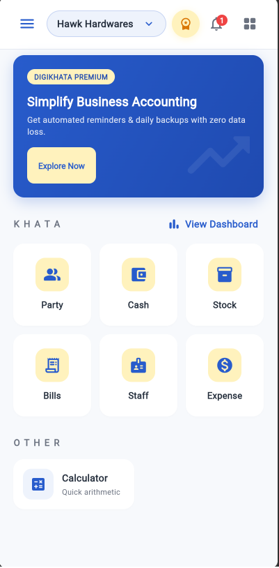
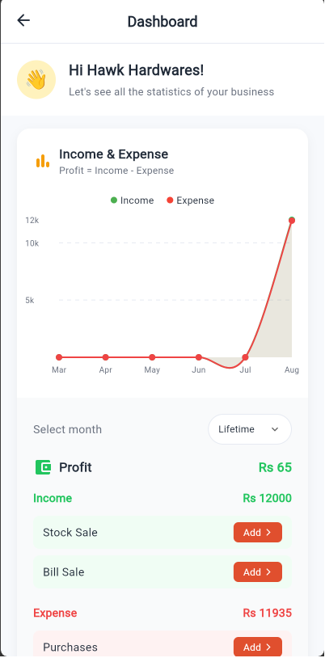
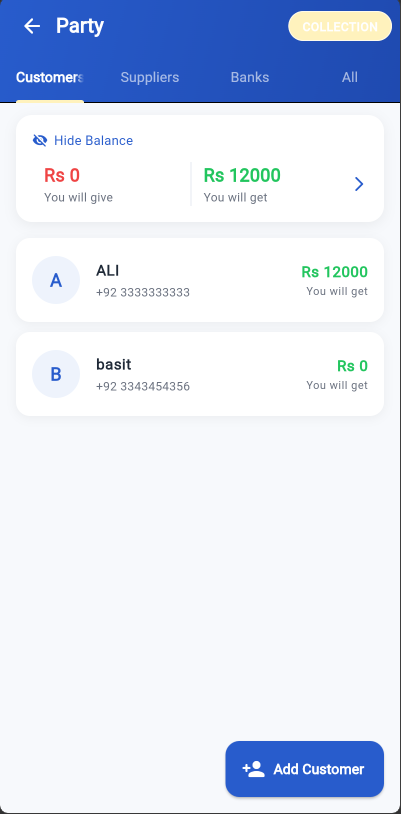
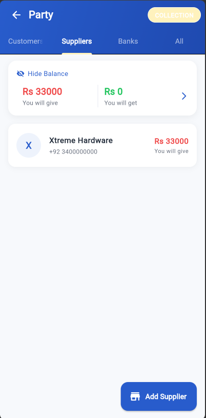
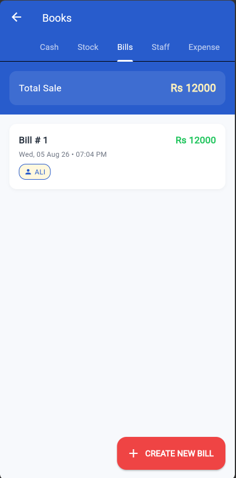

# DigiKhata Clone

## Project Overview
A complete clone of the DigiKhata bookkeeping & credit-ledger app, rebuilt from scratch using Flutter with Supabase as the backend. The goal is to replicate DigiKhata's real-world functionality, business logic, and workflow — customer/supplier ledgers, cash book, transactions, reports, reminders — while using a brand-new, original Blue Theme UI.

## Features
- **Onboarding & Auth**: Email-only auth with OTP, existing account login, and new account profile/business setup.
- **Home Dashboard**: Quick access to KHATA modules (Party, Cash, Stock, Bills, Staff, Expense), graphical statistics (Income vs Expense), profit summary, and receivables/payables.
- **Party Module (Customers/Suppliers)**: Add customers/suppliers, manage "You Gave / You Got" ledger entries with amount, linked stock items, and notes. Includes PDF report generation.
- **Stock Book**: Manage stock items, view stock IN/OUT reports, link items to suppliers.
- **Bill Book**: Create and manage sales/purchase bills with auto-population of entries into the Cash Book.
- **Cash & Expense Books**: Manual cash entries and expense tracking.
- **In-App Notifications**: Internal notification center for updates on tasks like adding parties, creating bills, and stock transactions.

## Packages Used
- **`provider`**: State management
- **`supabase_flutter`**: Backend as a Service (Auth, Database, Storage)
- **`google_fonts`**: Typography
- **`intl`**: Date and number formatting
- **`fl_chart`**: Dashboard statistics charting
- **`shared_preferences`**: Local storage and offline cache
- **`pdf` & `printing`**: PDF generation and printing for ledger reports
- **`path_provider`**: Accessing the device file system
- **`share_plus`**: Sharing generated reports via other apps
- **`url_launcher`**: Launching external URLs (e.g. calling customers)

## Screenshots

<div align="center">
  
  
  
</div>
<br/>
<div align="center">
  
  
</div>

## Setup Instructions
1. **Clone the repository**
2. **Install dependencies:**
   ```bash
   flutter pub get
   ```
3. **Configure Backend:**
   - Create a project on [Supabase](https://supabase.com).
   - Execute all the SQL files located in the `supabase/migrations/` directory in your Supabase project's SQL Editor to create the necessary tables and RLS policies.
   - Update your Supabase URL and Anon Key where appropriate in the app's configuration (`lib/core/services/supabase_service.dart` or via environment variables).
4. **Run the App:**
   ```bash
   flutter run
   ```
